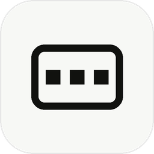
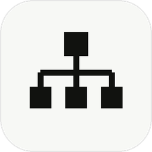

# Doppl

### A shared workroom for you, your AI, and your team.

Every AI tool today is a private chat between one person and a bot. Doppl makes it a **room**:
a space where your AI works in the open, teammates can join the same conversation, and
**manager agents** run whole teams of worker agents for you. All on your own Mac.
No account, no cloud, no setup.

 

<!-- Affiliation & sponsor — individual buttons: each bordered, rounded, spaced -->

 

 

---

<table>
  <tr>
    <td width="50%" valign="top" align="center">
       
      
      <h3>A room, not a chatbox</h3>
      
Work with AI in rooms that keep their history and can hold more than one
      person. The conversation you have with your AI is the same one a teammate can walk into.
      No copy-pasting screenshots of what the bot said.

      
You don't need a team to start: solo, Doppl is a calmer way to run your
      AI, and the room you already work in is the one you later share.

       
    </td>
    <td width="50%" valign="top" align="center">
       
      
      <h3>Agents that manage agents</h3>
      
Give Doppl a bigger job and a manager agent runs it: it splits the work
      across other agents, reviews what comes back, and interrupts you only when a decision is
      genuinely yours.

      
You supervise the manager, not every worker. And because it all happens in
      a room, you or anyone you invite can look in on the work at any time.

       
    </td>
  </tr>
</table>

## Why Doppl is different

- **It uses the AI you already have.** Doppl doesn't sell you another subscription. If Claude Code
  or Codex is signed in on your Mac, Doppl gives it a place to do real work on real folders.
- **Nothing leaves machines you control.** There is no Doppl server in the middle, no account, and
  no cloud relay. Sharing a room connects your Macs directly over a private, encrypted connection.

## The loop

| ① Install | ② Work | ③ Share | ④ Own it |
|:--:|:--:|:--:|:--:|
| Drag one app to Applications and open it. No account, no setup, no terminal | Pick a folder and put your AI to work, using the Claude Code or Codex login already on your Mac | Working with someone? Invite their Mac into a room. They see that room and nothing else | Your conversations, code, and credentials stay on computers you control |

## Download

Open the [release list](https://github.com/sarptandoven/doppl-releases/releases) and pick the
newest release offered for your cohort. Doppl needs **macOS 12 Monterey or newer**; your processor
is shown under **Apple menu → About This Mac**.

| Your Mac | Installer |
|---|---|
| Apple Silicon (M-series) | `…arm64.dmg` |
| Intel | `…x64.dmg` |

Every supported build is signed with an Apple Developer ID and **notarized by Apple**, so it opens
with no security warnings. Each release ships checksums (`SHA256SUMS`) and build evidence, so you
can verify exactly what you're running. A release marked **Pre-release** is a controlled pilot,
not the stable channel.

## Five minutes to a shared room

1. Mount the DMG that matches your processor, drag **Doppl** to Applications, and launch it from
   Finder.
2. Choose **On this Mac**, then **Open personal Doppl**, and pick the folder Doppl may work in.
3. Start working with the Claude Code or Codex login already on that Mac. Doppl does not provide
   or host the model credential.
4. To share a room, connect both Macs to the same Tailscale network (a free app that links your
   computers privately). On the owner's Mac, open **Settings → Shared access**, enable the private
   HTTPS path, and create a one-use invitation.
5. Open that invitation in Doppl on the second Mac. It grants that computer the invited room only,
   not the owner's private work, repositories, credentials, memory, or settings.
6. Before trying an update or moving to a new Mac, make a password-encrypted backup under
   **Settings → Backup & recovery**.

## What Doppl deliberately doesn't do

Most of these boundaries are the point:

- **No cloud in the middle.** Doppl runs on your Mac and operates no relay for room contents.
  Sharing connects Macs directly over private HTTPS.
- **The owner's Mac hosts its rooms**, so it must be awake and reachable while invited people use
  them.
- **Everyone runs their own AI.** Each person's agents run on their own Mac, against a folder they
  approved themselves.
- **Tailscale is the supported sharing path** for the macOS pilot.
- **Windows and Linux downloads are unsupported** unless their release notes say their signing and
  lifecycle gates are complete.
- **Back up important work** before evaluating a prerelease.

## Help

| I want to… | Go to |
|---|---|
| Get ordinary help or report a problem | [SUPPORT.md](SUPPORT.md) |
| Report a security issue privately | [SECURITY.md](SECURITY.md) |
| Understand exactly what stays on my Mac | [PRIVACY.md](PRIVACY.md) |

 

Doppl is built at the **University of Waterloo** and released under the
**[MIT License](LICENSE)**. © 2026 Doppl.

 

**Doppl is the room where you, your AI, and your team meet.**
 Real work, out in the open, on hardware you own.

